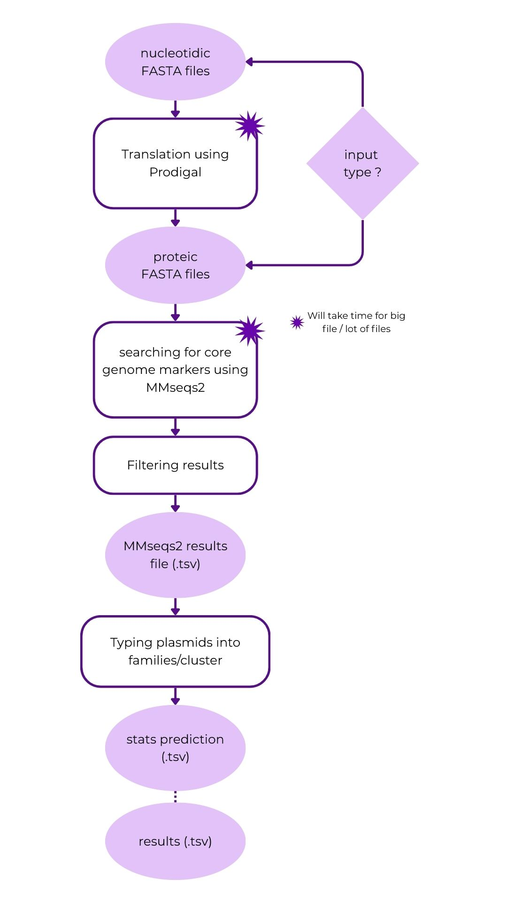

# ℙ𝕝𝕒𝕤𝕞𝕚𝕕𝕋𝕪𝕡𝕖𝕣 

Command-line tool for automated plasmid family classification using protein marker search and a machine learning model (pytorch).

---
                                                            𖣔
            ⋆                                                                          ✶
                    ⭑               ✶                                 ⋆                                ✶
                        ✯                    ⭒                            ✧
                                                    ꧁ 𝓟𝓵𝓪𝓼𝓶𝓲𝓭𝓣𝔂𝓹𝓮𝓻 ꧂                      ⋆
            ⭒                            ✧
                                ⭑                                       ⭑             ✲
                    ⋆                           ✶                                              ⭒
                                                            𖣔
---

## Documentation

### Description

PlasmidTyper takes one or more plasmid sequences (`fasta`) and classifies them into plasmid families. It does so by searching into a curated database of family-specific protein markers using MMseqs2, then scoring each plasmid against all families using a machine learning model. The top-3 most likely families are reported for each plasmid, along with confidence scores in *predictions_stats.tsv*. A summary of the plasmid's predicted family is given in *results.tsv*.

#### Pipeline steps

1. **Translation** *(optional)* — Prodigal translates nucleotide FASTA to protein FASTA (results written in `Prodigal_res`)
2. **MMseqs2 search & filtering** — each plasmid is searched against the marker database then hits below per-marker thresholds (qcov, tcov, pident) are removed (results written to `MMseqs2_res.tsv`)
3. **Typing** — hits are scored using the the AI model (results written to `results.tsv` and `predictions_stats.tsv` for more details on the scoring part.)




#### Why?

Plasmid typing is a key step in understanding the epidemiology of antimicrobial resistance (AMR). Existing tools often require exact sequence identity or are limited to specific incompatibility groups. PlasmidTyper uses protein-level homology search and core genomes, making it more robust to sequence divergence, and supports machine-learning-based classification strategies.

---

## Installation & Usage

### Setup 

For plasmid_typer to work, you will need an environment with python and MMseqs2 installed. You will also need to install prodigal if your files aren't already translated in a fasta protein format.
To install MMseqs2 and prodigal, we recommend that you create an environment first and then install them in it (you can use conda or pixi for that).

We will first explain how to create a new environment with conda and pixi then we'll explain how to install PlasmidTyper with Pipy.
For dockers usage, see the next update.

### Environment configs

#### Installation with conda 

To create a new environment with python, mmseqs2 and prodigal, open a terminal and write :
```bash
conda create -n name_env python=3.10 mmseqs2 prodigal -c conda-forge -c bioconda
```
with `name_env` the name you want your environment to be named.
Then, activate your new environment : 
```bash
conda activate name_env
```
And finally install plasmid_typer.
In your new environment, launch this command :
```bash
pip install plasmid_typer
```

#### With pixi 
To create a new environment with pixi, open your terminal and write in the folder you want your environment in : 
```bash
pixi init name_env
```
with `name_env` the name you want your environment to be named.

Then go in your environment like you do for any folder :
```bash
cd name_env
```
Add python, pip, MMseqs2 and Prodigal to your environment:
```bash
pixi add python=3.10
pixi add pip
pixi add prodigal
pixi add mmseqs2
```
If you're having troubles adding mmseqs2 or prodigal, try opening the pixi.toml file and add `bioconda` in the channel section. Then try again. 

If there is still an issue, you can try this command : `pixi add bioconda::mmseqs2`.

And finally install plasmid_typer with this command :
```bash
pixi run pip install pip install plasmid_typer
```


### Container configs

None (yet)

### Usage

```bash
plasmid_typer query_path [options]
```
*With pixi, simply add `pixi run` before the command as `pixi run plasmid_typer query_path`*

#### Requirements 

- Requires plasmid sequences as input in one of these 4 forms : 
    - one directory with proteic fasta files
    - one directory with nucleotidic fasta files
    - one file in proteic fasta (containing sequences from multiple plasmids)
    - one file in proteic or nucleotidic (containing the sequence of only one plasmid)
    - to use one file containing multiples sequences in nucleotidic fasta, it is required that each header look like this : `>FileName_ProtNumber` (Prodigal will use this format automatically if you use it to translate your sequences)
- Do not use headers with '_' in your files other than to separate the name of your plasmid and the protein number (it will not work and you could obtain wrong results)
- Plasmids with few or highly divergent markers may be classified as `UNKNOWN`

#### Example

Single plasmid (protein sequences)
```bash
plasmid_typer my_plasmid.faa -o results
```

Folder of plasmids, will use 8 CPU to run and will run Prodigal first
```bash
plasmid_typer my_sequences/plasmids -o results -t 8 -n
```

One file with multiple sequences, will run with low MMseqs2 sensitivity, low sensitivity to core genomes, will not delete mmseqs2 file results and will use 6 CPU
```bash
plasmid_typer new_plasmids_database/merged.fasta -o new_plasmids_database/results --sensitivity 5 --mode permissive -rm -t 6
```


#### Arguments

| Flag | Default | Description |
|---|---|---|
| `query_path` | *(Required)* | Path to a `.fasta` file or a folder containing multiple `.fasta` files (also `.fna`, or `.faa`) |
| `-o`, `--output_path` | `working_directory/PlasmidTyper_<timestamp>` | Path to the output folder where `/PlasmidTyper_<timestamp>` will be created |
| `-d`, `--database_path` | `directory where is installed PlasmidTyper` | Path to the database directory |
| `--model`, `-m` | `database/model.pt` *(after 1st time launching)* | Path to pre-trained classification model |
| `--prodigal_output_path` | `output directory` | Path to the Prodigal output directory/file |
| `--mmseqs_output_path` | `output directory` | Path to the MMseqs2 output directory/file |
| `--tmp_dir` | `output directory` | Path to the template directory were to write template files Note that it will be deleted at the end of runtime. |
| `-t`, `--n_threads` | `2` | Number of threads used by mmseqs2 |
| `-s`, `--sensitivity` | `7.5` | MMseqs2 sensitivity, the lower, the faster [4;7.5] |
| `-f`, `--files` | `False` | Disaggregate all MMseqs2 results in many files instead of one |
| `-n`, `--nucleotide` | `False` | ranslate nucleotide input with Prodigal before search |
| `-v`, `--mmseqs_verbosity` | `2` | Verbosity level of mmseqs2 (0:quiet, 1:errors, 2:warnings, 3:infos) |
| `-q`, `--prodigal_quiet` | `True` | Re-activate verbosity of prodigal |
| `-rm`, `--remove_mmseqs` | `True` | If activated, will not delete the mmseqs file.s in the output directory |
| `-rp`, `--remove_prodigal` | `False` | Will delete the prodigal file.s in the output directory |
| `--batch_size` | `256` | size of batch load in one go for the model reading |
| `--mode` | `balanced` | choose between `strict`(family predicted are certain, probably more related_to/unknown results), `balanced` or `permissive`(will diminish unknown results, great for a first launch on a unknown database) mode  |

---

#### Output

| File | Description |
|---|---|
| `results.tsv` | One row per plasmid - predicted family & all their characteristics |
| `predictions_stats.tsv` | One row per plasmid - predicted family, top-3 families and probabilities |
| `MMseqs2_res/` or `MMseqs2_res.tsv` | Filtered MMseqs2 results (optional) |

Plasmids with a top-1 probability below the confidence threshold are reported as `UNKNOWN`.

---

## Architecture

```
plasmid_typer/
├── plasmid_typer.py          # Entry point — argument parsing, call main module
└── scriptes/
    ├── main.py               # Main pipeline: path management, call all functions
    ├── config.py             # Parsing & parameter validation
    ├── mmseqs2.py            # MMseqs2: run MMseqs2 
    ├── mmseqs2_utils.py      # MMseqs2: DB index creation & result filtering
    ├── translate.py          # Prodigal for nucleotide → protein translation
    └── AI/
        ├── type_plasmids.py   # High-level typing functions
        └── utils.py           # Regroups functions and Class def

database/
    ├── markers_cluster_specific_plasmids_atleast3.faa   # Protein marker database
    ├── markers_thresholds_database.tsv                  # Per-marker qcov/tcov/pident thresholds
    ├── infos_cluster.tsv                                # cluster family database
after download
    └── model_for_inference*.pt                          # Pre-trained model
```

---

## Dependencies

| Python dependency | Version |
|---|---|
| Python | 3.10|
| numpy | 1.24|
| pandas | 2.0|
| scipy | 1.10|
| torch/pytorch | 2.0 |
| tqdm | 4.65|

| non-python dependency | Version |
|---|---|
| mmseqs2 | 18.8cc5c|
| Prodigal *(only with `-n`)* | 2.6.3  |

---

## References

- Steinegger M and Soeding J. *MMseqs2 enables sensitive protein sequence searching for the analysis of massive data sets.* Nature Biotechnology (2017).
- Kallenborn F, Chacon A, Hundt C, Sirelkhatim H, Didi K, Cha S, Dallago C, Mirdita M, Schmidt B, Steinegger M. *GPU-accelerated homology search with MMseqs2.* Nature Methods (2025)
- Prodigal by Doug Hyatt, *https://github.com/hyattpd/Prodigal* 2016
- Ansel, J., Yang, E., He, H., Gimelshein, N., Jain, A., Voznesensky, M., Bao, B., Bell, P., Berard, D., Burovski, E., Chauhan, G., Chourdia, A., Constable, W., Desmaison, A., DeVito, Z., Ellison, E., Feng, W., Gong, J., Gschwind, M., Hirsh, B., Huang, S., Kalambarkar, K., Kirsch, L., Lazos, M., Lezcano, M., Liang, Y., Liang, J., Lu, Y., Luk, C., Maher, B., Pan, Y., Puhrsch, C., Reso, M., Saroufim, M., Siraichi, M. Y., Suk, H., Suo, M., Tillet, P., Wang, E., Wang, X., Wen, W., Zhang, S., Zhao, X., Zhou, K., Zou, R., Mathews, A., Chanan, G., Wu, P., & Chintala, S. (2024). *PyTorch 2: Faster Machine Learning Through Dynamic Python Bytecode Transformation and Graph Compilation* [Conference paper]. 29th ACM International Conference on Architectural Support for Programming Languages and Operating Systems, Volume 2 (ASPLOS '24). https://doi.org/10.1145/3620665.3640366
- Harris, C.R., Millman, K.J., van der Walt, S.J. et al. *Array programming with NumPy.* Nature 585, 357-362 (2020). DOI: 10.1038/s41586-020-2649-2. 
- Pauli Virtanen, Ralf Gommers, Travis E. Oliphant, Matt Haberland, Tyler Reddy, David Cournapeau, Evgeni Burovski, Pearu Peterson, Warren Weckesser, Jonathan Bright, Stéfan J. van der Walt, Matthew Brett, Joshua Wilson, K. Jarrod Millman, Nikolay Mayorov, Andrew R. J. Nelson, Eric Jones, Robert Kern, Eric Larson, CJ Carey, İlhan Polat, Yu Feng, Eric W. Moore, Jake VanderPlas, Denis Laxalde, Josef Perktold, Robert Cimrman, Ian Henriksen, E.A. Quintero, Charles R Harris, Anne M. Archibald, Antônio H. Ribeiro, Fabian Pedregosa, Paul van Mulbregt, and SciPy 1.0 Contributors. (2020) *SciPy 1.0: Fundamental Algorithms for Scientific Computing in Python.* Nature Methods, 17(3), 261-272. DOI: 10.1038/s41592-019-0686-2.
- Wes Mc Kinney, *Data Structures for Statistical Computing in Python* Proceedings of the 9th Python in Science Conference , 56-61, 2010.

---

## Authors

- Pierre Bouteyre - scripte creation (June 2025)
- Lou Planterose - modifications, optimization, publication and documentation (2026)
- Charles Coluzzi - Machine learning creation and supervisor (2025-2026)
